# NYC Yellow Taxi EDA Project

Technical exploratory data analysis of 2023 NYC Yellow Taxi trip records, built as a notebook-first project.

This public repository intentionally excludes parquet trip data from version control.

## Project Overview

This project analyzes operational, financial, temporal, and geospatial patterns in New York City Yellow Taxi trips. The goal is to turn raw trip records into decisions a taxi operator could actually use:

- where demand concentrates by time and zone
- when revenue rises or softens across the year
- how fare, distance, duration, tipping, and surcharges relate
- which zones and hours should drive dispatching and pricing strategy

The analysis is implemented in a single end-to-end notebook and supported by exported plots, geospatial shapefiles, and locally stored parquet data.

## Business Objective

Assume you are supporting a taxi fleet entering or expanding in NYC. The analysis is meant to answer questions such as:

- When are pickups busiest?
- Which zones generate the most activity?
- How strongly does fare scale with trip distance and trip duration?
- When do weekday and weekend demand patterns diverge?
- Where and when are surcharges most common?
- Which operational and pricing decisions are justified by the data?

## Dataset

- Source: NYC Taxi and Limousine Commission Yellow Taxi trip records for 2023
- Format: Monthly parquet files plus NYC taxi zone shapefiles
- Scope: 12 monthly trip files, zone geometry, and TLC data dictionary
- Data dictionary: [data/data_dictionary_trip_records_yellow.pdf](data/data_dictionary_trip_records_yellow.pdf)

### Data Handling

Parquet trip files are not committed to GitHub in this portfolio version of the project.

Reasons:

- keep the repository lightweight
- avoid publishing large local data files
- separate reproducible analysis code from local raw-data storage

### Sampling Strategy

The original monthly parquet files are large, so the notebook builds a representative working dataset by sampling **5% of trips within each date-hour bucket** using `tpep_pickup_datetime`. This keeps hourly and seasonal demand patterns intact while making iterative analysis feasible on a laptop.

The notebook can generate a sampled working dataset locally at:

- `data/trip_records/sampled_2023_data.parquet`

## Repository Structure

```text
.
├── assets/plots/                  # README-ready exported visuals
├── data/
│   ├── taxi_zones/                # TLC zone shapefiles
│   ├── trip_records/              # local parquet files only; ignored by git
│   └── data_dictionary_trip_records_yellow.pdf
├── notebooks/
│   └── EDA_NYC_Taxi_Analysis_Vinod_Khadka.ipynb
├── reports/
│   ├── EDA_NYC_Taxi_Analysis_Vinod_Khadka.pdf
│   └── EDA-Variation.pdf
├── environment.yml
└── README.md
```

## Tech Stack

- Python
- Jupyter Notebook / JupyterLab
- NumPy
- Pandas
- Matplotlib
- Seaborn
- GeoPandas
- PyArrow

## Methodology

The notebook follows a clear analysis flow:

1. Load one month to inspect schema and scale.
2. Build a stratified sample across all 12 months.
3. Clean missing values and standardize columns.
4. Remove implausible outliers and invalid trip records.
5. Engineer analytical features:
   - `pickup_hour`, `pickup_day`, `pickup_month`, `pickup_quarter`
   - trip duration
   - fare per mile
   - fare per mile per passenger
   - tip percentage
   - surcharge-applied flags
6. Join trip records to TLC taxi zone shapefiles.
7. Analyze demand, revenue, geography, pricing, tipping, and surcharges.
8. Turn findings into operational and pricing recommendations.

## Key Findings

- Demand peaks in the evening commute window, with the busiest hour at **18:00**.
- Weekday demand has sharper commute spikes, while weekend demand remains active later into the night.
- Fare amount has a strong positive relationship with trip distance, with a notebook-reported correlation of **0.95**.
- Tip amount also rises with distance, with a reported correlation of **0.79**.
- High-activity zones include **Upper East Side South**, **Midtown Center**, **JFK Airport**, and **Upper East Side North**.
- Revenue softens in the mid-year period, especially across **July to September**, suggesting opportunities for demand stimulation.
- Surcharges concentrate in the busiest commercial and airport-linked zones and rise at specific times of day.

## Plot Gallery

### Highlights

**Demand by Hour**

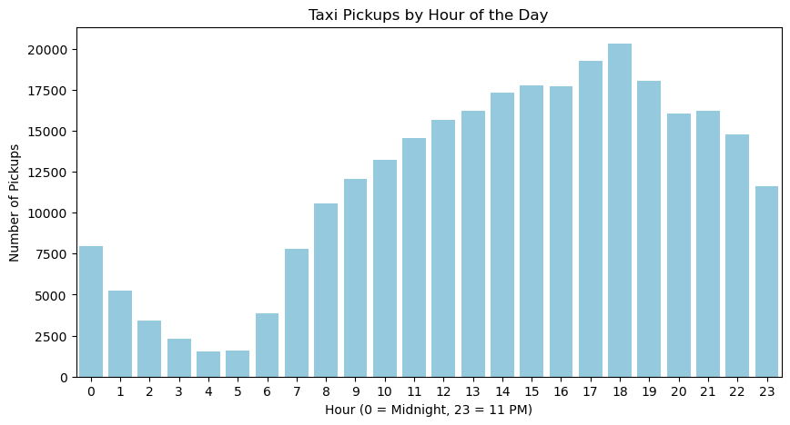

**Monthly Revenue Trend**

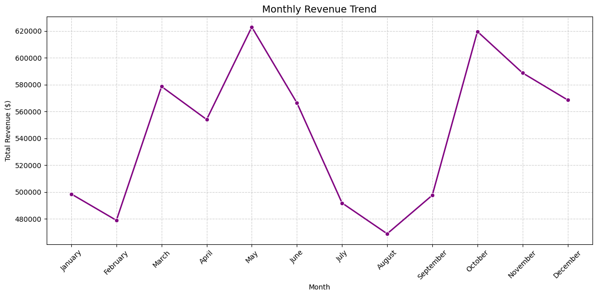

**Trip Distance vs Fare**

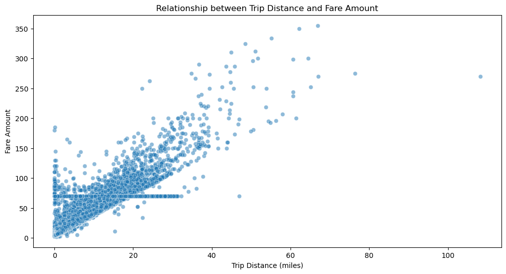

**Zone-wise Trip Density**

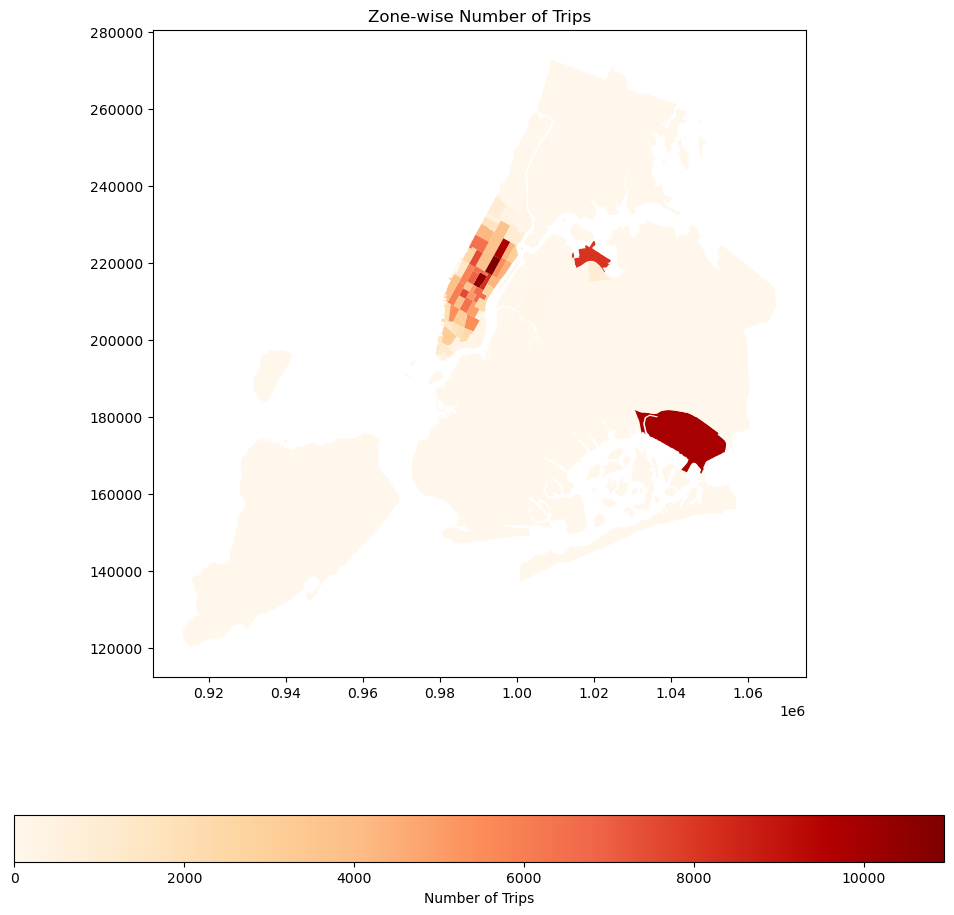

### More Visuals

**Data Quality and Feature Relationships**

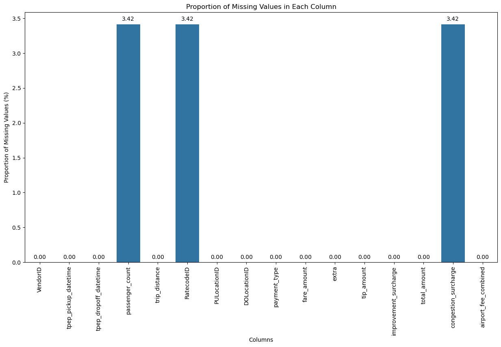
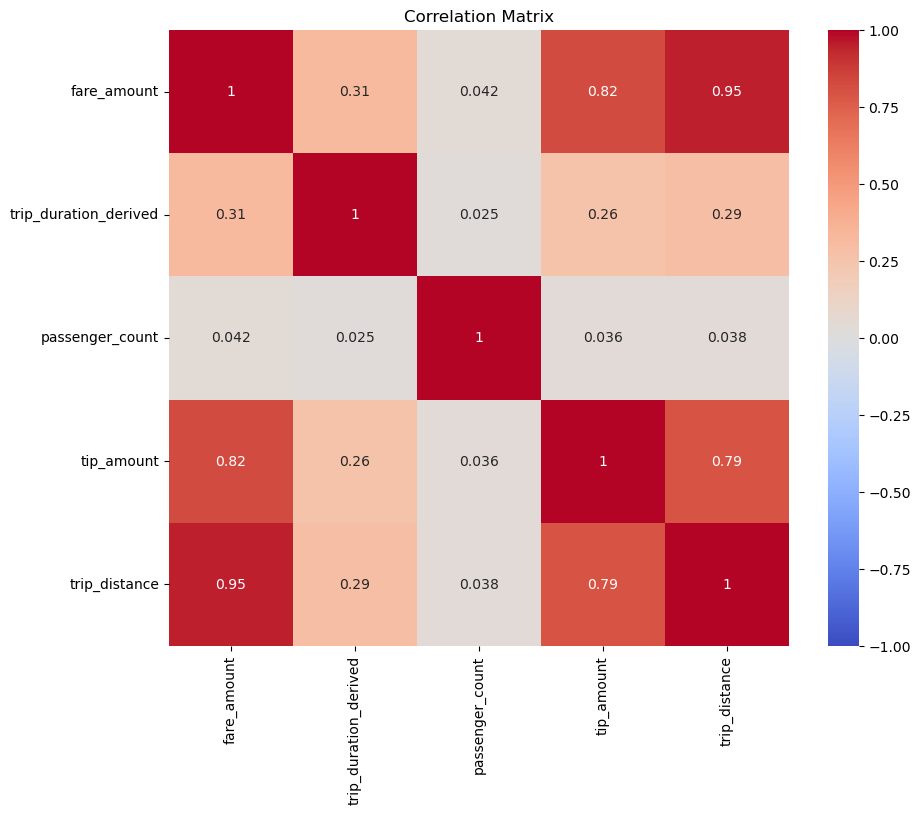

**Temporal Behavior**

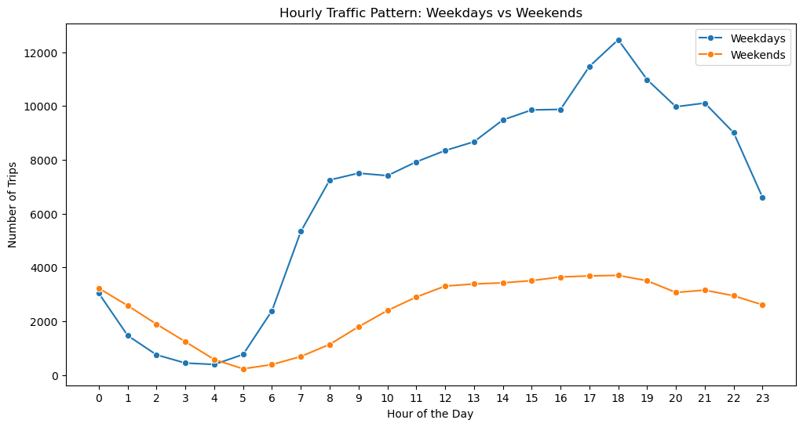
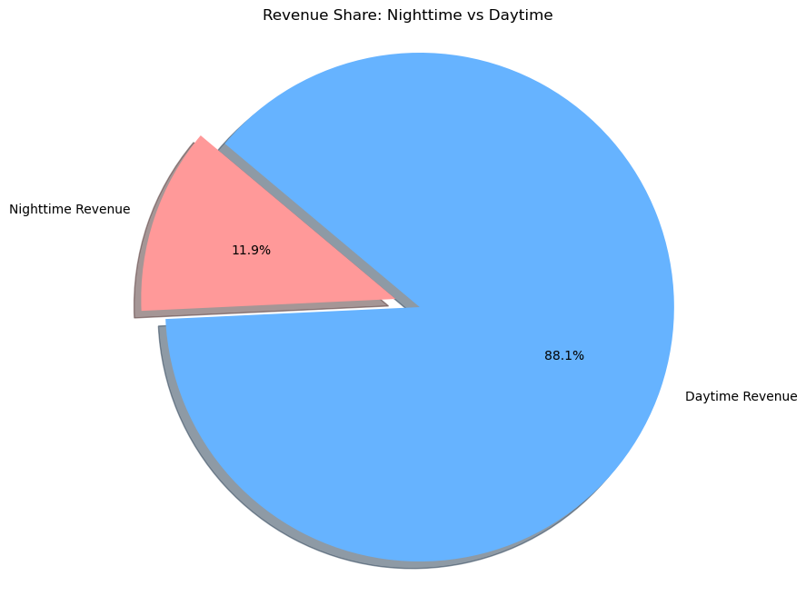

**Pricing, Tipping, and Surcharges**

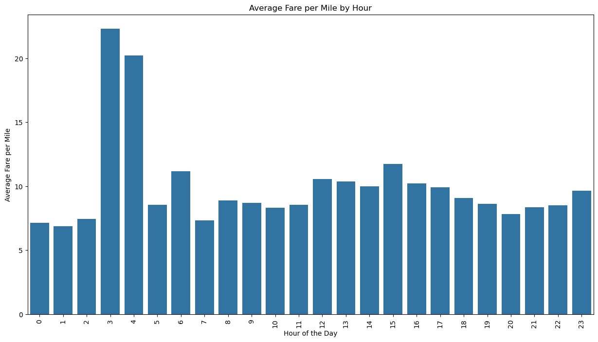
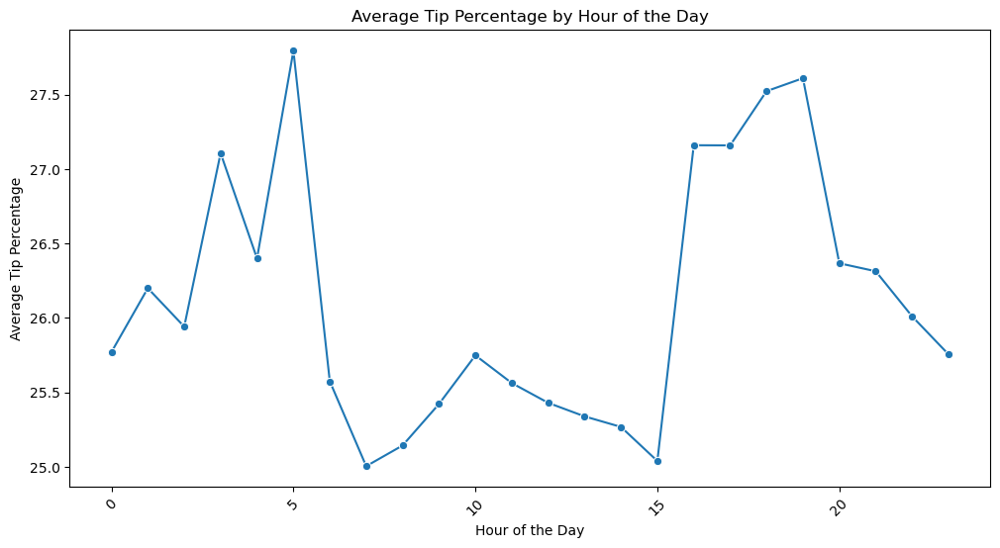
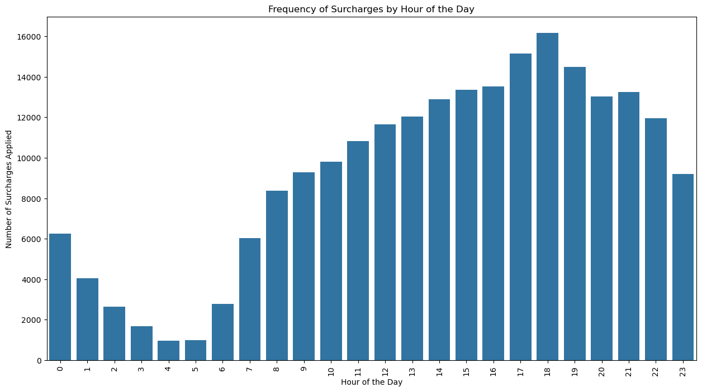

**Operational Heatmap**

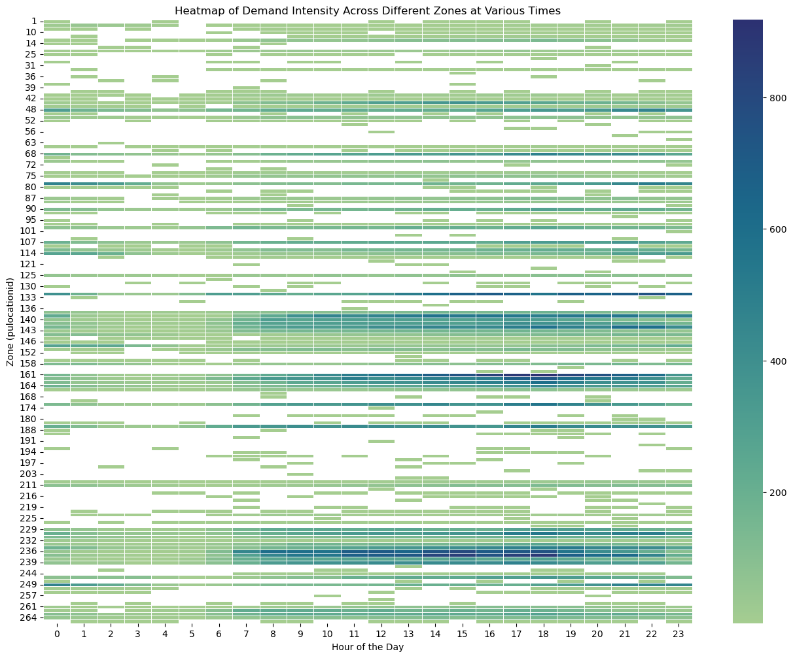

## Main Artifacts

- Notebook: [notebooks/EDA_NYC_Taxi_Analysis_Vinod_Khadka.ipynb](notebooks/EDA_NYC_Taxi_Analysis_Vinod_Khadka.ipynb)
- Exported report: [reports/EDA_NYC_Taxi_Analysis_Vinod_Khadka.pdf](reports/EDA_NYC_Taxi_Analysis_Vinod_Khadka.pdf)
- Alternate report: [reports/EDA-Variation.pdf](reports/EDA-Variation.pdf)
- License: [LICENSE](LICENSE)

## Build and Run

### 1. Clone the repository

```bash
git clone <your-github-repo-url>
cd <repo-name>
```

### 2. Add the data locally

Place the required parquet files in:

- `data/trip_records/`

This repo does not commit the parquet trip files.

### 3. Create the Conda environment

```bash
conda env create -f environment.yml
conda activate nyc-taxi-eda
```

### 4. Register the Jupyter kernel

```bash
python -m ipykernel install --user --name nyc-taxi-eda --display-name "Python (nyc-taxi-eda)"
```

### 5. Launch Jupyter

```bash
jupyter lab
```

Open:

- `notebooks/EDA_NYC_Taxi_Analysis_Vinod_Khadka.ipynb`

## Data Paths Used by the Notebook

The notebook is already aligned to the current repository layout:

- raw monthly files: `../data/trip_records/2023-*.parquet`
- sampled file: `../data/trip_records/sampled_2023_data.parquet`
- shapefile: `../data/taxi_zones/taxi_zones.shp`

## Reproducing the Analysis

You can use the project in two ways:

### Option A: Fast path with a local sampled file

Use a locally generated sampled parquet file:

- `data/trip_records/sampled_2023_data.parquet`

This is the quickest way to rerun the notebook once the sample has been created on your machine.

### Option B: Rebuild the sample from raw monthly parquet files

Use the full monthly files in:

- `data/trip_records/2023-1.parquet` through `data/trip_records/2023-12.parquet`

The notebook contains the logic to:

- iterate over monthly files
- derive `pickup_date` and `pickup_hour`
- sample 5% within each date-hour group
- concatenate the monthly samples
- write the combined sampled parquet back to disk

## Notes

This project is intentionally presented as:

- a notebook-first analytical workflow
- a business-facing EDA with operational recommendations
- a reproducible repo with data, plots, and report artifacts
- a geospatial analysis example using real-world NYC zone shapes

The public repo contains the notebook, reports, plots, shapefiles, and supporting metadata, but not the raw parquet trip records.
